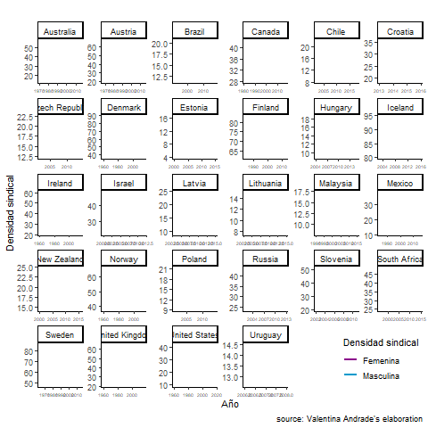
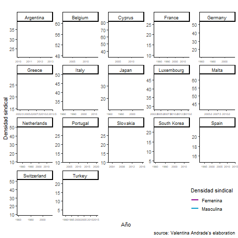

<!--more-->

Es común escuchar que las mujeres son pasivas o menos militantes a las organizaciones políticas (Sinclair, 1995; Walters, 2002). Esta idea tan extendida se ha ido removiendo resultado de la destacable convocatoria que han tenido las manifestaciones feministas en el mundo en el último siglo. Sin embargo, poco se ha mostrado cómo se organizan las mujeres en el trabajo, probablemente reflejo de que sigue siendo asociado a un espacio masculino (Greene & Kirton, 2006).

## ¿Qué es la densidad sindical?

La densidad sindical (o sindicalización) es una métrica que nos dice que porcentaje de los trabajadores participan en organizaciones sindicales en relación a su participación en el mercado laboral. Para el caso de las mujeres, su sindicalización se calcula como el total de las mujeres sindicalizadas divido en el total de las mujeres ocupadas o asalariadas . Otra medida es la proporción de sindicalización, que nos señala cuantos del universo total de afiliados corresponden a mujeres u hombres, por ejemplo. 
Más mujeres en los sindicatos
Recientes cifras en Chile mostraron no solo un aumento en la densidad sindical de mujeres, sino que una feminización de la sindicalización. Esto quiere decir que la proporción de sindicalización femenina supera a la masculina. Lo más interesante de ello es que no es un caso excepcional (Mapa1 ): 27 de los 45 países estudiados la sindicalización femenina ha superado la masculina, 17 sigue masculinizada la participación sindical y solo en Sudáfrica es equitativa la proporción. 

<iframe src="map" width="576" height="420" scrolling="no" frameborder="0" webkitallowfullscreen mozallowfullscreen allowfullscreen ></iframe>

Título: Feminización de la sindicalización en el mundo
Fuente: Andrade (2020) en base a Encuestas de Hogares, ICTWSS y Gapminder (2019)
Nota: Se consideró el último dato disponible de sindicalización por país.  

## ¿Cómo ha cambiado esto en el tiempo?

A inicios del siglo XX, en la mayoría de los países los hombres estaban más organizados que las mujeres. Sin embargo, ya con los cambios de la sociedad industrial, y con las mujeres cada vez más vinculadas a las fábricas (ILO, 2010), estas pusieron en marcha orgánicas para defender sus derechos: equidad salarial, jornadas parciales que les permitiera conciliar sus empleos con el trabajo doméstico y seguridad social. Un ejemplo de ello son congresos como International Congress of Workers Women (ICWW) en 1919 donde participaron países como Argentina, Bélgica, Canadá, Checoslovaquia, Francia, Gran Bretaña, India, Italia, Noruega, Polonia y Suecia, Cuba, Dinamarca, Japón, Países Bajos, Serbia, España y Suiza (Lubin & Winslow, 1990, p. 26). 

Con la globalización las mujeres no perderían el impulso asociativo, y podremos notar en el gráfico 2  que la tendencia de feminización se extiende cada vez en más países: Inglaterra, Suecia, Noruega, Estonia, Finlandia, Canadá, Australia, Rusia, Islandia, Nueva Zelanda, Dinamarca, México, Brasil y Chile son algunos ejemplos de países. Sin embargo, muchas veces de la mano con un descenso generalizado de la sindicalización (Haile, 2017).

## Chile: un caso interesante de sindicalización femenina 

Estudios en Chile habían mostrado que la tendencia de sindicalización femenina iba en aumento, pero este positivo escenario se opacaba con que de igual forma las mujeres están subrepresentadas  en cargos de dirigencia (Riquelme & Abarca, 2015). 

<iframe src="grafico_chile" width="576" height="420" scrolling="no" frameborder="0" webkitallowfullscreen mozallowfullscreen allowfullscreen ></iframe>

Más allá de ese contexto, las cifras más recientes en nuestro país permiten mostrar que a pesar de que la brecha salarial de género iba en aumento, es decir, que hombres ganaban en promedio más que las mujeres, ese dato se comienza a revertir de la mano con la feminización de la sindicalización (Grafico 2) ¿Existirá alguna relación entre estos dos fenómenos? 

## Un proyecto en camino
La información y preguntas detalladas son abordadas en la tesis de nuestra [asistente de investigación Valentina Andrade](https://valentinaandrade.github.io/tesis/). Ella en su proyecto busca analizar qué determinantes explican los cambios en la densidad sindical de mujeres a nivel internacional entre 1960 a 2018. 

