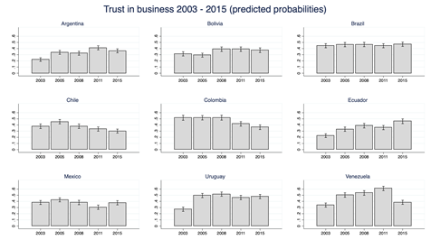
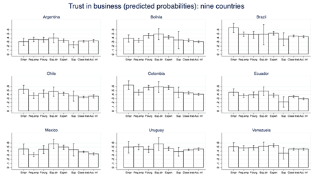

<!--more-->

En los últimos años, Chile ha atravesado una serie de eventos políticos que demuestran la existencia de un conflicto de clases que, al menos en apariencia, se mantuvo oculto por décadas. Este conflicto se ha expresado de diversas formas, desde las huelgas del sector portuario entre 2013 y 2018 , o más recientemente la gran Huelga General convocada por el bloque sindical de Unidad Social el 15 de noviembre de 2019 , hasta movilizaciones de masas que desde octubre de 2019 han concentrado a millones de personas en las calles. 

Más allá de las particularidades de cada fenómeno, la evidencia empírica indica que dichas acciones de protesta y movilización se encuentran estructuradas, al menos en parte, por antagonismos de clase que durante años se expresaron en la polarización de percepciones, intereses y actitudes. Durante décadas, la investigación sociológica se ha preocupado de estudiar dicha polarización a través de encuestas de opinión (Evans, 1992; Kelley & Evans, 1995; Robison & Stubager, 2018; Wright, 1997). Si bien es claro que existe una brecha larga entre lo que las personas piensan (por ejemplo, cómo ellas cuestionan la desigualdad de clases) y sus acciones (o sea, si deciden movilizarse para cambiar el estado de cosas), estas investigaciones han demostrado que **en sociedades donde las actitudes están más polarizadas, es más probable que emerjan actores colectivos que movilicen dichos intereses de clase.** 

	Medir intereses de clase a través de encuestas es un proceso difícil y no exento de dificultades (Wright, 1997, capítulo 10). En Chile, la Encuesta COES (2014) permite realizar una primera aproximación a dicho fenómeno. A partir de dicha encuesta, se construyó una “Escala de oposición de clase” compuesta de las respuestas a los siguientes ítems:
	
1. “Las grandes empresas deberían hacer algo para reducir las diferencias salariales entre los trabajadores de altos salarios de aquellos con bajos salarios” 

2. “El alto nivel de vida de los dueños de las empresas es resultado de lo poco que pagan a sus trabajadores”; 

3. “Una de las principales razones de la alta desigualdad en Chile es que los dueños de las empresas pagan poco a sus trabajadores”; 

4. “Los empresarios se benefician a costa de los consumidores”.  

A partir de estos enunciados, la “Escala de oposición de clase” pretende medir, en un puntaje de 0 a 100, la manera en cómo se percibe el poder empresarial. Un mayor puntaje en esta escala indica mayor oposición de clase—es decir, actitudes más críticas hacia el rol del empresariado (detalles estadísticos sobre la construcción, validez y confiabilidad de esta escala podrán ser encontrados en Pérez y Andrade (2020)).   

El gráfico 1 presenta los resultados del puntaje promedio de la escala para cada clase social . El gráfico presenta al menos dos elementos que merecen ser destacados. Primero, el nivel promedio de oposición de clase percibida por todas las personas encuestadas es bastante alto—76 puntos de un máximo de 100. Esto sugiere que, en línea con los discursos anti-neoliberales promovidos por los movimientos sociales en los últimos años, las actitudes críticas hacia el rol del empresariado son predominantes en el país. En segundo lugar, el gráfico indica que dichas actitudes están definidas por la posición de clase social: quienes pertenecen a la clase trabajadora o incluso a segmentos de la clase media (como la pequeña burguesía formal) tienen intereses contrarios al empresariado más fuertes que, por ejemplo, quienes pertenecen al empresariado (mediano y gran empresariado) o a la clase de directivos expertos (gerentes). Análisis estadísticos multivariados convencionales (regresiones) indican que esta relación entre clase social y percepciones de la oposición de clase se mantiene robusta incluso luego de incluir diversas variables de control (ver Pérez y Andrade (2020)).   

<iframe src="https://fabricadedatoslaborales.netlify.app/post/percepciones-conflicto/grafico1.html" width="576" height="420" scrolling="no" frameborder="0" webkitallowfullscreen mozallowfullscreen allowfullscreen ></iframe>

Gráfico 1. Puntaje promedio para cada clase social en Escala de oposición de clase (0 a 100 puntos). 

Fuente: Elaboración propia a partir de datos de Encuesta COES 2014 (n= 929) 

## Chile en perspectiva comparada

¿Es el caso de Chile sustancialmente diferente de lo que ocurre en otros países? Lamentablemente no existen encuestas internacionales que contengan la misma información recién analizada y que permitan, por tanto, hacer comparaciones fidedignas. Una buena forma de sortear este problema es recurriendo a las encuestas de opinión que, durante años, se han aplicado simultáneamente en varios países precisamente para hacer comparaciones internacionales. Una de ellas es la Encuesta Latinobarómetro, la cual, en diversos años, ha medido la confianza ciudadana en instituciones como las empresas privadas. 

El gráfico 2 muestra la probabilidad de confiar en las empresas privadas en nueve países de América Latina entre 2003 y 2015. Las probabilidades fueron calculadas a partir de modelos de regresión logística con errores estándares robustos (para detalles estadísticos sobre estos modelos ver Pérez y Elbert, [2019]) . Los resultados del gráfico 2 indican que, a diferencia de otros países como Argentina, Bolivia, Brasil o Uruguay, en Chile la probabilidad de confiar en las empresas privadas disminuyó consistentemente entre 2005 y 2015. Así, si en 2005 la probabilidad de que los/as chilenos/as confiaran en las empresas era de alrededor de 45%, en 2015 ella fue de sólo 30% (los intervalos de confianza arriba de cada barra indican que la probabilidad para 2015 fue, con un 95% de confiabilidad, significativamente más baja que para 2005 o 2008). 

Gráfico 2. Probabilidad de confiar en empresas privadas, 2003 – 2015 (países seleccionados)

Fuente: elaboración propia a partir de datos de Encuesta Latinobarómetro (n= 39.003) 

 ¿Qué hay de la relación entre clase social y confianza en las empresas privadas? En línea con lo afirmado al comienzo de este escrito, el gráfico 3 indica que, más allá de diferencias importantes entre países, quienes pertenecen a la clase trabajadora y a la clase de los autoempleados informales tienen niveles de confianza en las empresas privadas que son significativamente más bajos que quienes pertenecen a la clase de los empresarios o de expertos directivos (gerentes). Si bien esta relación varía en cada país, la tendencia general tiende a mantenerse. En Chile, por ejemplo, alguien perteneciente al empresariado (mediano y grande) tiene casi un 55% de probabilidades de confiar en las empresas privadas, mientras que la probabilidad de alguien de la clase trabajadora es de menos del 35%. Esta diferencia entre clases es, nuevamente, estadísticamente significativa según los criterios estadísticos convencionales (95% de confiabilidad). 

Gráfico 3. Probabilidad de confiar en empresas privadas, según clase social (países seleccionados)

Fuente: elaboración propia a partir de datos de Encuesta Latinobarómetro (n= 39.003) 

## Clase y conflicto social

Todos estos datos muestran simples respuestas a preguntas estandarizadas en encuestas. Es claro que estas opiniones no representan, en sí mismas, formas de oposición de clase tal como las observadas, por ejemplo, en acciones colectivas como marchas, concetraciones o huelgas. 

Sin embargo, a la luz de los fenómenos observados en los últimos años en el país, y especialmente desde el 18 de octubre de 2019, estas cifras indican que dichos fenómenos pueden ser la expresión de procesos de polarización de clase que se venían incubando por años ente chilenas/os, al menos a nivel subjetivo. En este sentido, estos datos parecen reafirmar la tesis de que no es posible analizar el conflicto en la sociedad neoliberal sin tomar en cuenta sus determinantes de clase.     
 

### Referencias

Evans, G. (1992). Is britain a class-divided society? A re-analysis and extension of marshall et al.'S study of class consciousness. Sociology, 26(2), 233-258.

Kelley, J., & Evans, M. D. R. (1995). Class and class conflict in six western nations. American Sociological Review, 60(2), 157-178.

Pérez Ahumada, P. (2018). Clases sociales, sectores económicos y cambios en la estructura social chilena (1992 – 2013). Revista CEPAL, 126, 171-192. 

Pérez, P. & Elbert, R. (2019). Social class, collective action, and their effects on class interests: a view from Latin America. Artículo presentado en el XXXVII Congress of the Latin American Studies Association (LASA), Boston, MA, EE.UU., 24 – 27 de Mayo.

Pérez, P. & Andrade, V. (2020). Entendiendo la política de clases en Chile: clase social, politización y percepciones de conflicto. Manuscrito no publicado (en revisión).

Robison, J., & Stubager, R. (2018). The class pictures in citizens’ minds. The British Journal of Sociology, 69(4), 1220-1247.

Wright, E. O. (1997). Class counts: Comparative studies in class analysis. Cambridge: Cambridge University Press.

